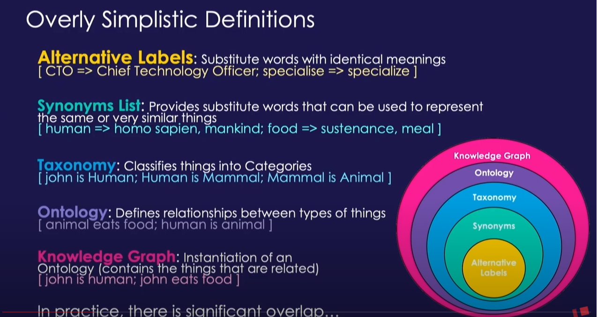
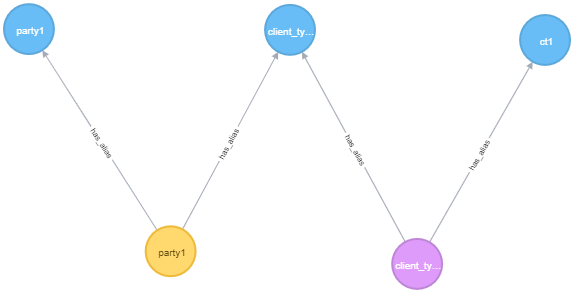

# GraphTool

## Contents
[Description](#description)  
[Goal](#goal)  
[Hierarchy](#hierarchy)  
[Samples](#samples)  
[Database](#database)  
[User interface](#userinterface)  
[Mastering](#mastering)  
[Analytics](#analytics)  
[Reading documents](#readingdocuments)

## Description
There seems to be more and more need for information that is 'hidden' within an organization. 
Excel sheets, word documents, Confluence pages, etc.

## Goal
- easy to use tool for adding and maintaining entities and relations
- create the organisations ontology
- extract entities and relations from documents and create the organization's ontology based on that  
- be the master data repository (?)
- ability to recognize an ontology 'item' using machine learning from documents
- train a nlp model using the initial classified dataset
- avoid time consuming maintanance
- Containerized  
- Deployable in AWS  

Graphical interface using d3.js  
The tool should supply several analytical options, like:
- shortest path to node y
- basic graph analytics: degree, centrality, betweenness
- proces analytics based on edge types
- show semantical problems caused by using different namings for the same entity
- show all direct relations to a specific node

## Hierarchy

## Samples
https://www.amundsen.io/

## Database
Current db is Neo4j but it should be easy to switch to AWS Neptune or any other graph db. 

## User interface
Basic HTML setup: 
  - source node type
  - source node id (example: person name, city name, etc)
  - relation type
  - target node type
  - target node id

On selection each of the basic inputs the tool should supply suggestions.
Sample:
1. user enters field 'source node type'
2. user enters character 'p'
3. tool suggest all known node types starting with 'p', adjusting itself on each new character
4. user enters field 'source node id'
5. user enters character 'p'
6. tool suggest all known node names, of the previously selected node type, starting with 'p', adjusting itself on each new character
7. if node exists all know properties of the node will be displayed below the 2 source node fields.

Furthermore, the user should be able to add supplementary properties to the nodes and/or edges

## Data mastering/matching
Every node can have one or more 'aliasses' (or synonyms). These are names that the specific enity is also referred to in the organization but that are not defined as the official name.  
The alias is used in the update proces. If in a new dataset (excel, word, jira, etc) the entities that are found in the document are matched against the exisiting nodes and their aliasses.

The alias offers the opportunity the show possible semantical problems, for instance when an alias is used for more than one entity.
Once properly populated, the aliasses can help in training machine learning models.

### proces for new nodes:  
- define node type  
- find matching nodes of the same type in neo4j  
  - if match: no action. Node already exists
   - if not match: find matching names in alias nodes in neo4j
      - if match: check if more than one node are related to the alias
         - if > 1: use algo to decide
         - if 1: rebase the new node to the node related to the alias. + add sourcename to alias

## Visualization
- show full graph
- selection per node, show all direct relations
- selection per edge type

## Analytics
Show basic network analytics: degrees, pagerank, betweennes  

## Reading documents  
- read all nodes from neo, including aliasses
- populate spacy matcher with neo nodes and types
- get entities from text
- bring entities back to proper ontology (use just one term for an entity)

# Knowledge graph
## Information Extraction (IE)  
There are multiple approaches to perform information extraction automatically:

- Rule-based Approach: We define a set of rules for the syntax and other grammatical properties of a natural language and then use these rules to extract information from text  
- Supervised: Let’s say we have a sentence S. It has two entities E1 and E2. Now, the supervised machine learning model has to detect whether there is any relation (R) between E1 and E2. So, in a supervised approach, the task of relation extraction turns into the task of relation detection. The only drawback of this approach is that it needs a lot of labeled data to train a model  
- Semi-supervised: When we don’t have enough labeled data, we can use a set of seed examples (triples) to formulate high-precision patterns that can be used to extract more relations from the text  

## Steps
1. Preprocess
    - extract text from source
    - split into pieces?
2. Resolve Co References 
   - use neuralcoref for co reference
3. Classify entities (NER: named entity recognition)
      - use spacy for NER
      - use Hearsh patterns (https://www.analyticsvidhya.com/blog/2019/09/introduction-information-extraction-python-spacy/?utm_source=medium&utm_medium=how-to-build-knowledge-graph-text-using-spacy)
      - classify entities by type (person, application, etc)
3. Extract Entities  
   - Store entity aliases in the DB and match new entities with these.
   - check if entity already exists (as entity or as alias), if not: add to db
   - 
3. Extract Relations
4. Link to Knowledgebase
5. Ingest into target Knowledge Graph

# graph tech samples  

### sample 1  
Party 'party1' has alias 'client_type1'. client type 'client_type1' has aliasses 'client_type1' and 'ct1'. Could party 'party1' also have alias 'client_type1'?  

## Neuralcoref library
### Install
      git clone https://github.com/huggingface/neuralcoref.git  
      cd neuralcoref  
      pip install -r requirements.txt  
      pip install -e . 

### Install spacy
      pip install -U spacy
      python -m spacy download en_core_web_sm
      python -m spacy download nl_core_news_sm

### Sample code
    doc = nlp(u'My sister has a dog. She loves him.')  
    print('All the clusters of corefering mentions in the doc')  
    print(doc._.coref_clusters)
    print(doc._.coref_clusters[1].mentions)
    print(doc._.coref_clusters[1].mentions[-1]._.coref_cluster.main)
    
    print('Unicode representation of the doc where each corefering mention is replaced by the main mention in the associated cluster.')
    print(doc._.coref_resolved)
    
    print('Scores of the coreference resolution between mentions.')
    print(doc._.coref_scores)
    
    span = doc[-1:]
    print('	Whether the span has at least one corefering mention')
    print(span._.is_coref)
    # print(span._.coref_cluster.main)
    # print(span._.coref_cluster.main._.coref_cluster)
    
    token = doc[-1]
    print(token._.in_coref)
    print(token._.coref_clusters)

## Definitions
> ### Ontology
> In computer science and information science, an ontology encompasses a representation, formal naming and definition of the categories, properties and relations between the concepts, data and entities that substantiate one, many, or all domains of discourse. More simply, an ontology is a way of showing the properties of a subject area and how they are related, by defining a set of concepts and categories that represent the subject.  
> Every academic discipline or field creates ontologies to limit complexity and organize data into information and knowledge. New ontologies improve problem solving within that domain. Translating research papers within every field is a problem made easier when experts from different countries maintain a controlled vocabulary of jargon between each of their languages.

> ### Taxonomy
> Taxonomy is the practice and science of categorization or classification. The word finds its roots in the Greek language τάξις, taxis (meaning 'order', 'arrangement') and νόμος, nomos ('law' or 'science').

> ### TF-IDF
> In information retrieval, tf–idf, TF*IDF, or TFIDF, short for term frequency–inverse document frequency, is a numerical statistic that is intended to reflect how important a word is to a document in a collection or corpus.[1] It is often used as a weighting factor in searches of information retrieval, text mining, and user modeling. The tf–idf value increases proportionally to the number of times a word appears in the document and is offset by the number of documents in the corpus that contain the word, which helps to adjust for the fact that some words appear more frequently in general. tf–idf is one of the most popular term-weighting schemes today. A survey conducted in 2015 showed that 83% of text-based recommender systems in digital libraries use tf–idf.

